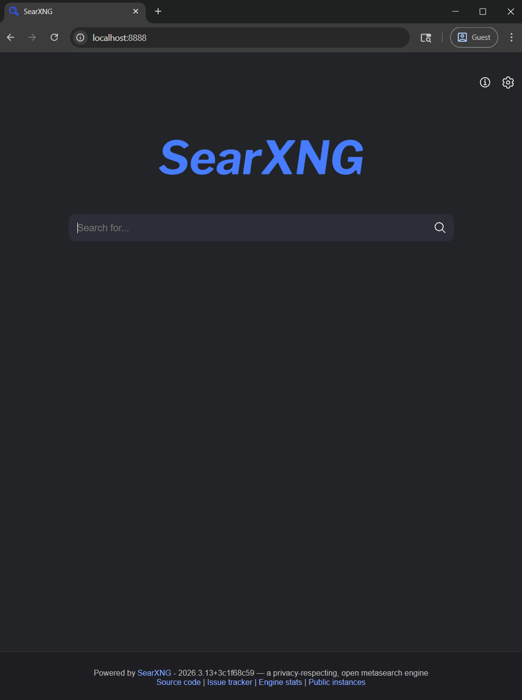
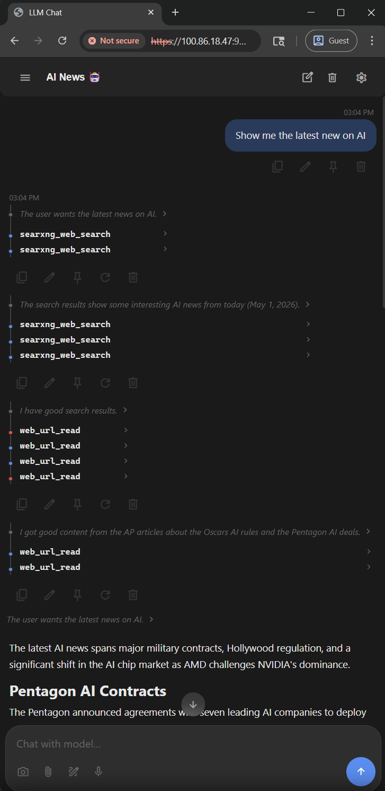
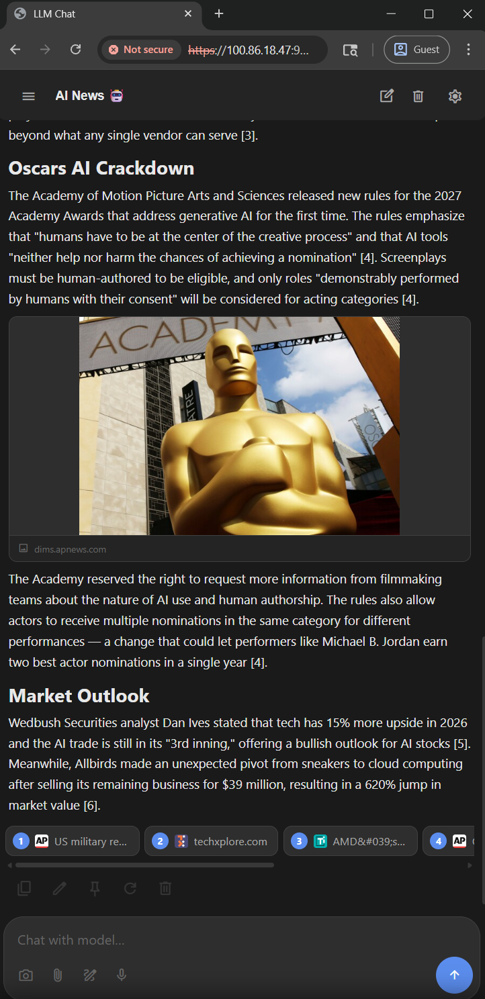
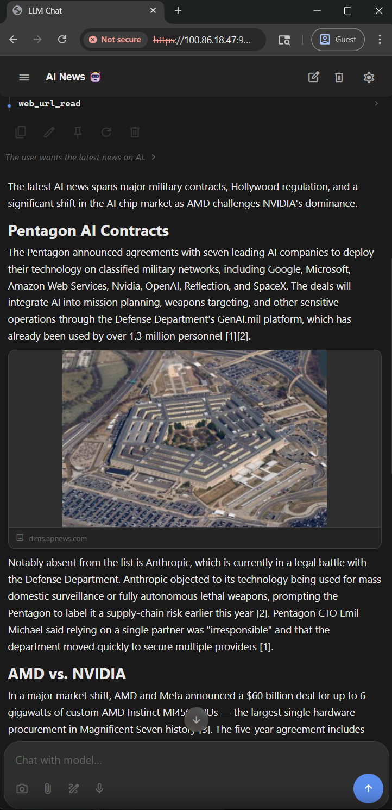
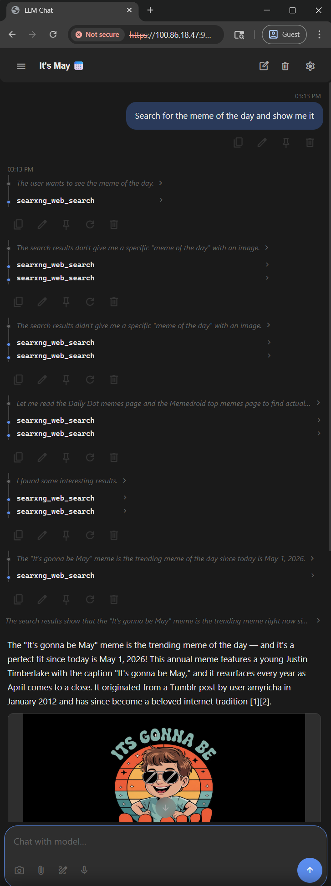
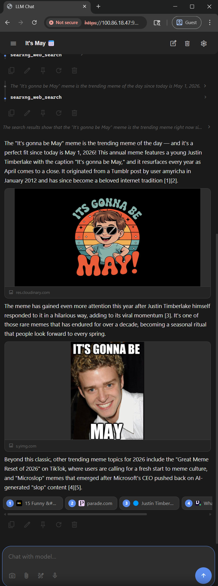

# WebSearch SearXNG + MCP Server

A self-hosted SearXNG metasearch engine paired with the `mcp-searxng` MCP server, **built for LLMs, agents, and tool-using applications**. Lets your model (or autonomous agent) browse the web, run searches across many engines at once, and surface images directly in your front end. Runs entirely on your own machine via Docker, accessed from your browser, and speaks MCP over HTTP Streamable transport so it plugs into any MCP-compatible client (Claude Desktop, Cline, Open WebUI, LM Studio, custom agent frameworks, etc.). Enhanced with image/video/category search, offset pagination, and smart base64 image resizing for vision-capable models. Both services stay on your local network, so nothing leaves your box unless you ask it to.

<table cellspacing="0" cellpadding="0" border="0">
  <tr>
    <td align="center" valign="top" width="280">
      <a href="assets/searxng-frontend.png">
        
      </a>
      <br>
      <sub><b>SearXNG frontend</b> — the privacy-respecting metasearch UI at <code>localhost:8888</code>. Same backend the MCP server queries internally.</sub>
    </td>
    <td width="20"></td>
    <td align="center" valign="top" width="280">
      <a href="assets/llm-tool-chain.png">
        
      </a>
      <br>
      <sub><b>Autonomous tool chain</b> — model fires multiple <code>searxng_web_search</code> calls in parallel, then chains into <code>web_url_read</code> to pull full article text.</sub>
    </td>
    <td width="20"></td>
    <td align="center" valign="top" width="280">
      <a href="assets/text-extraction.png">
        
      </a>
      <br>
      <sub><b>Clean text extraction</b> — long-form article content pulled by <code>web_url_read</code>, boilerplate stripped, ready for the model to summarize.</sub>
    </td>
  </tr>
</table>

<br><br>

<table cellspacing="0" cellpadding="0" border="0">
  <tr>
    <td align="center" valign="top" width="280">
      <a href="assets/inline-news-image.png">
        
      </a>
      <br>
      <sub><b>Inline image in news briefing</b> — image fetched and resized through <code>web_url_read</code>'s <code>sharp</code> pipeline. No external CDN, served as a base64 MCP image block.</sub>
    </td>
    <td width="20"></td>
    <td align="center" valign="top" width="280">
      <a href="assets/meme-multi-query.png">
        
      </a>
      <br>
      <sub><b>Multi-query parallel search</b> — queries separated by <code> | </code> fan out several <code>searxng_web_search</code> calls at once, landing on the "It's Gonna Be May" meme.</sub>
    </td>
    <td width="20"></td>
    <td align="center" valign="top" width="280">
      <a href="assets/meme-images-inline.png">
        
      </a>
      <br>
      <sub><b>Native image blocks</b> — multiple images returned inline. The <code>detail</code> parameter (<code>low</code>/<code>medium</code>/<code>high</code>) controls resize quality vs. token cost.</sub>
    </td>
  </tr>
</table>

## Installation

> **Quick note on privacy before you start.** This stack runs entirely on your machine and is privacy-respecting by design (no telemetry, no accounts, no third-party trackers), but the defaults are tuned for "just works," not maximum privacy. Before exposing it beyond your own computer, to your LAN, the internet, or anyone else please read **[ADVANCED.md](ADVANCED.md)**

### Prerequisites
- Docker and Docker Compose must be installed
- Node.js >= 20 must be installed

### Step 1: Clone the Repository

```bash
git clone https://github.com/hypersniper05/MCP-WebSearch-SearXNG.git
cd MCP-WebSearch-SearXNG
```

This gives you the `docker-compose.yml`, the SearXNG `settings.yml`, the MCP patches, and the custom `Dockerfile` already laid out — so the next step is straight to configuration.

> Prefer to set everything up by hand instead of cloning? See [**Building from scratch (without cloning)**](ADVANCED.md#building-from-scratch-without-cloning) in ADVANCED.md.

### Step 2: Configure SearXNG Settings

The shipped `searxng/config/settings.yml` is **already preconfigured** for this stack — JSON output enabled, rate limiter off, fast engine retries, a curated set of working engines (Bing, Mojeek, Yahoo, Startpage, etc.). The only thing you need to touch here is the `secret_key`.

> Want to change which engines are enabled, the request timeout, or any other SearXNG default? See [**Modifying the default settings**](ADVANCED.md#modifying-the-default-settings) in ADVANCED.md.

#### Set the `secret_key` (or use the env var)

The shipped `settings.yml` has a placeholder `secret_key: "CHANGE_ME_BEFORE_RUNNING"`. SearXNG **will start** with the placeholder, so for a localhost-only personal instance you can leave it and come back to this later. **But** if you ever bind to `0.0.0.0`, expose this to your LAN, or share it with anyone, generate a real one — otherwise an attacker can forge image-proxy and CSRF tokens against your instance.

Two ways to set it (pick one):

**Option A — env var (recommended):**

Create a `.env` file next to `docker-compose.yml`:
```
SEARXNG_SECRET=<paste your generated 64-char hex string here>
```
The env var overrides whatever is in `settings.yml`, so the placeholder can stay in the tracked file forever.

**Option B — edit `settings.yml` directly:**

Replace the placeholder with your generated key. If you do this, make sure not to leak your `settings.yml`.

**Generate a key with whichever tool you have installed:**
```powershell
# PowerShell (Windows — built in)
[System.BitConverter]::ToString([System.Security.Cryptography.RandomNumberGenerator]::GetBytes(32)).Replace('-','').ToLower()
```
```bash
# Node.js (already installed for the MCP server)
node -e "console.log(require('crypto').randomBytes(32).toString('hex'))"

# Docker (works anywhere this stack does)
docker run --rm alpine sh -c "apk add --no-cache openssl > /dev/null && openssl rand -hex 32"

# Git Bash / Linux / macOS
openssl rand -hex 32

# Python
python -c "import secrets; print(secrets.token_hex(32))"
```

For the rest of the privacy/hardening trade-offs (LAN exposure, MCP auth, Tor routing), see **[ADVANCED.md](ADVANCED.md)**.

### Step 3: Build and Start Everything

```bash
cd MCP-WebSearch-SearXNG
docker compose build
docker compose up -d
```

### Step 4: Verify Services

Health check:
```bash
curl -s http://localhost:3001/health
```

Expected: `{"status":"healthy","server":"ihor-sokoliuk/mcp-searxng","version":"0.9.2-enhanced","transport":"http"}`

Test search:
```bash
curl -s "http://localhost:8888/search?q=test&format=json" | head -c 200
```

## Endpoints Summary

| Service     | URL                          | Purpose                    |
|-------------|------------------------------|----------------------------|
| SearXNG UI  | http://localhost:8888        | Web search interface       |
| SearXNG API | http://localhost:8888/search | JSON search API            |
| MCP Server  | http://localhost:3001/mcp    | MCP Streamable HTTP        |
| MCP Health  | http://localhost:3001/health | Health check endpoint      |

## MCP Tools

### 1. searxng_web_search
Web search with category, pagination, and filtering support.

| Parameter    | Type   | Description |
|-------------|--------|-------------|
| `query`      | string | Search query (required) |
| `categories` | string | `general`, `images`, `videos`, `news`, `music`, `files`, `it`, `science`, `social media`, `map` |
| `max_results`| number | Results per batch (default: 20 general, 10 images/videos) |
| `offset`     | number | Skip N results for pagination (e.g., 10 for results 11-20) |
| `pageno`     | number | SearXNG page number |
| `time_range` | string | `day`, `month`, `year` |
| `language`   | string | Language code (e.g., `en`, `fr`) |
| `safesearch` | number | `0` (none), `1` (moderate), `2` (strict) |

### 2. web_url_read
Fetches and reads URLs. Auto-detects image URLs and returns resized base64 image blocks.

| Parameter      | Type    | Description |
|---------------|---------|-------------|
| `url`          | string  | URL to read (required) |
| `detail`       | string  | Image resize level: `low` (448px, ~256 tokens), `medium` (768px, ~756 tokens, default), `high` (1280px, ~2048 tokens) |
| `startChar`    | number  | Character offset for text pagination |
| `maxLength`    | number  | Max characters to return |
| `section`      | string  | Extract content under a heading |
| `paragraphRange`| string | Paragraph range (e.g., `1-5`) |
| `readHeadings` | boolean | Return headings only |

## Image Search Flow
1. `searxng_web_search({query: "sunset", categories: "images"})` → returns image URLs + metadata
2. Pick an image → `web_url_read({url: "https://example.com/sunset.jpg", detail: "medium"})` → returns resized base64 image
3. To see more results → `searxng_web_search({query: "sunset", categories: "images", offset: 10})` → results 11-20

## Custom Patch Files

All patches are in `mcp-searxng-patches/` and mounted read-only into the container:

| File | Purpose |
|------|---------|
| `Dockerfile` | Extends base image with `sharp` for image resizing |
| `types.js` | Tool schemas with `categories`, `offset`, `max_results`, `detail` parameters |
| `search.js` | Category-aware search formatting, offset pagination, image/video result fields |
| `url-reader.js` | `fetchImage()` with sharp resizing (3 detail presets), base64 MCP image blocks |
| `index.js` | Tool handler wiring, image URL detection, detail passthrough |

## Updating SearXNG

SearXNG is pinned to `:latest` in `docker-compose.yml`, so updates are pull-and-restart. Config in `searxng/config/settings.yml` is volume-mounted and survives the update.

### Manual update (recommended)
```powershell
cd MCP-WebSearch-SearXNG
docker compose pull searxng        # grab newest :latest image
docker compose up -d searxng       # recreate container with new image
docker compose logs searxng --tail 100   # check for config-schema warnings
docker image prune -f              # remove the old image
```

Major releases occasionally rename keys in `settings.yml` or add required fields. Check the [SearXNG releases page](https://github.com/searxng/searxng/releases) for breaking changes before updating.

### Pin to a specific version (safer / reproducible)
Replace `:latest` in `docker-compose.yml` with a date-tagged release, e.g.:
```yaml
image: docker.io/searxng/searxng:2026.4.15-abc1234
```
Updates then become an explicit edit — review release notes, bump tag, `docker compose up -d`.

### Automatic updates
| Option | Pros | Cons |
|--------|------|------|
| **Watchtower** container | Set-and-forget | Silent break on config-schema changes |
| Scheduled `docker compose pull && up -d` (Task Scheduler or `/schedule` agent) | You control cadence | Same schema-break risk |
| GitHub release notifications + manual update | Safest | Slowest |

A reasonable middle ground: schedule a weekly job that runs `docker compose pull` and reports whether a new image is available, but does not auto-apply it.

### Updating the MCP server
`mcp-searxng` is built locally from `mcp-searxng-patches/Dockerfile` (base: `isokoliuk/mcp-searxng:latest`) with custom JS patches mounted on top. To pull upstream MCP changes:
1. `docker compose build --pull mcp-searxng` — rebuilds from a freshly pulled base image
2. `docker compose up -d mcp-searxng` — recreates the container
3. Verify the patches in `mcp-searxng-patches/*.js` still apply cleanly against any upstream API changes (check `docker compose logs mcp-searxng` for errors)

If upstream renames internal modules or changes function signatures, the volume-mounted JS patches may need to be rebased manually.

## Tested With
- **Qwen3.6 35B A3B** — runs both `searxng_web_search` (including multi-query and category filters) and `web_url_read` (text + image modes) reliably. Tool selection, parameter inference, and result interpretation all work well with this model.

## Notes
- MCP server uses HTTP Streamable transport (not stdio or SSE-only)
- SearXNG connects internally via Docker hostname `searxng:8080`
- All data stays local — no external API keys needed
- Custom patches are MIT-licensed, audited, no filesystem/shell access, no telemetry
- Search engines: Bing, Startpage, Mojeek, Yahoo active; Google with mobile UI (may intermittently block)
